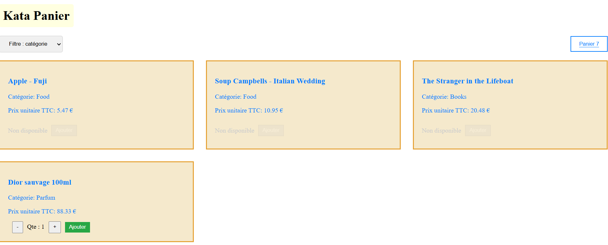
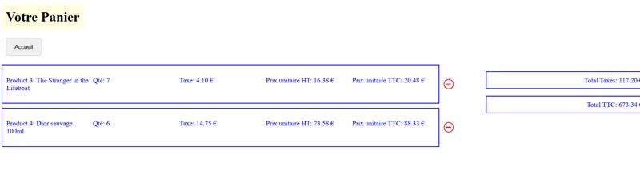

---

# Application de Gestion d'un Panier d'Articles


---

## Description

Ce projet est une application web développée avec Angular qui permet de gérer un panier d'articles.

## Prérequis

Avant de commencer, assurez-vous d'avoir les éléments suivants installés sur votre machine :

- [Node.js](https://nodejs.org/) (version 12 ou supérieure)
- Angular CLI (version 12 ou supérieure)

## Installation

1. Clonez le dépôt :

   ```bash
   git clone https://github.com/HKNawrez/basket-management.git
   cd votre-repo
   ```

2. Installez les dépendances :

   ```bash
   npm install
   ```

## Utilisation

Pour démarrer l'application en mode développement, utilisez la commande suivante :

```bash
  ng serve
```

Ensuite, ouvrez votre navigateur et accédez à `http://localhost:4200`.

## Structure du Projet

Une brève description de la structure du projet :
```
src/
├── app/
│   ├── components/
│   │    ├── basket
│   │    ├──empty-basket
│   │    ├──product-list
│   ├── models/
│   │    ├──product
│   ├── pipes/
│   │    ├──MultiTransformPipe
│   ├── services/
│   │    ├─basket
│   │    ├─BasketGuard
│   │    ├─ProductService
│   ├── app.component.ts
│   ├── app.module.ts
│   └── ...
├── assets/
├── app.component.html
├── app.component.scss
├── app.component.spec.ts
├── app.component.ts
├── app.config.ts
├── app.routes.ts
└── constants.ts
```
Pour exécuter les tests unitaires, utilisez la commande suivante :

```bash
  jest
```

## Déploiement

Pour construire le projet pour la production, utilisez la commande suivante :

```bash
  ng build --prod
```

Les fichiers de build seront générés dans le répertoire `dist/`.
